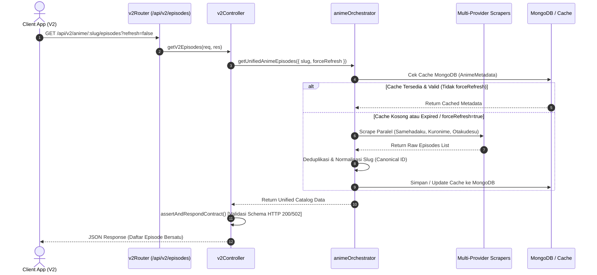
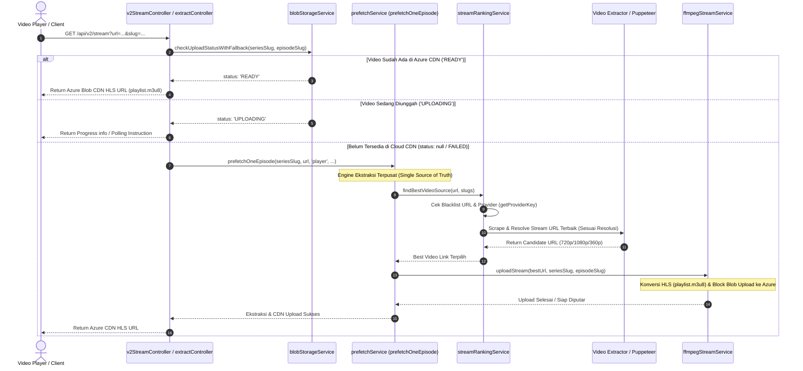
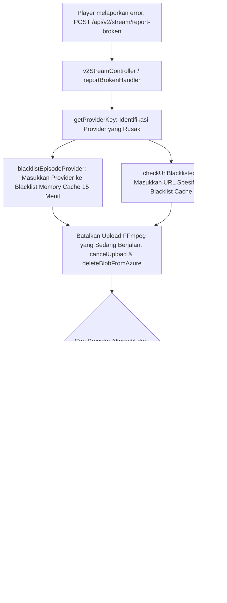
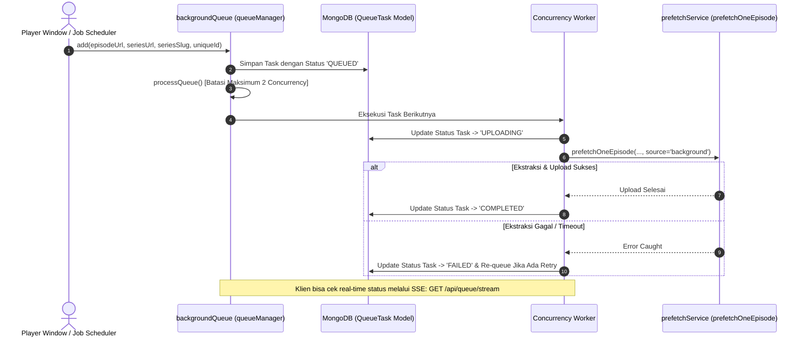

# 🌊 Wibuflix Backend — Complete Architecture & Task Flow

Dokumentasi ini memetakan **Task Flow (Alur Kerja)** end-to-end dari ekosistem **Wibuflix Backend (`samehadaku-scraper`)** yang telah direstrukturisasi ke dalam **Clean Layered Architecture (1 File = 1 Job / Single Responsibility Principle)**.

---

## 🏛️ Arsitektur Sistem & Lapisan Tanggung Jawab

Setiap modul di dalam aplikasi ini memiliki tepat satu tanggung jawab spesifik tanpa tumpah tindih (Zero Redundancy / Backward Compatibility Clutter):

| Lapisan (Layer) | Direktori / Modul | Tanggung Jawab Utama (Single Responsibility) |
| :--- | :--- | :--- |
| **1. Routers** | `src/routes/*.js` | Murni mendefinisikan *endpoint* HTTP/Express dan mengarahkan ke Controller yang tepat. |
| **2. Controllers** | `src/controllers/*.js` | Validasi input (*request query/params*), memanggil Service domain, dan memformat respons HTTP (serta validasi kontrak API). |
| **3. Domain Services** | `src/services/*.js` | Logika bisnis utama, orkestrasi multi-provider (`animeOrchestrator`), ranking server (`streamRankingService`), dan *unified extraction engine* (`prefetchService`). |
| **4. Scrapers & Extractor** | `src/services/scrapers/`, `extractors/` | Scraping HTML/JSON dari situs sumber eksternal (Samehadaku, Kuronime, Neosatsu, Otakudesu) dan ekstraksi tautan video (*stream link*). |
| **5. Storage & Stream** | `src/services/stream/*.js` | *Manajemen streaming*: Azure Blob Storage (`blobStorageService`), *progress state cache* (`uploadProgressService`), dan konversi HLS FFmpeg (`ffmpegStreamService`). |
| **6. Utilities & Jobs** | `src/utils/`, `src/jobs/` | *Cross-cutting helper*: antrean latar belakang (`queueManager`), penjadwal (`scheduler`), normalisasi teks (`stringUtils`), dan validasi kontrak (`contractValidator`). |

---

## 🔄 Task Flow 1: Metadata & Catalog Discovery (Thin Client V2)

Alur ini terjadi ketika aplikasi klien (React Native / Thin Client) meminta daftar episode anime yang diperkaya dari berbagai provider.



---

## 🚀 Task Flow 2: Unified Video Extraction & Cloud CDN Streaming

Inilah **inti** dari pemutaran video (`Smart-Play` / `API V2 Stream`). Seluruh ekstraksi didelegasikan ke mesin tunggal `prefetchOneEpisode` untuk menjamin konsistensi antara permintaan pengguna langsung dan pekerjaan latar belakang.



---

## 🛡️ Task Flow 3: Proactive Multi-Provider Failover (Error Handling)

Saat pengguna atau sistem mendeteksi video rusak (404 / 403 / proteksi Cloudflare / tanpa subtitle), sistem tidak mencoba *mirror* dari provider yang sama, melainkan **melakukan auto-switch ke provider alternatif**.



---

## ⚙️ Task Flow 4: Background Queue & Prefetch Automation

Untuk menghemat kuota dan memastikan pemutaran instan (*zero buffer*), sistem secara otomatis mengantrekan download video episode berikutnya saat episode sedang ditonton atau melalui *Scheduler*.



---

## 📊 Matriks Status Upload & Siklus Hidup File (`uploadProgressService`)

Siklus hidup setiap berkas video di dalam sistem dikelola melalui *State Store* berbasis memori dan Azure Storage secara sinkron:

```
[ NULL / NOT STARTED ]
         │
         ▼ (Ekstraksi Dimulai via prefetchOneEpisode)
 [ UPLOADING / PROCESSING ] ───► progress: 0% -> 99% (Dilacak oleh getUploadProgress)
         │
         ├────────────────────────────────────────┬────────────────────────────────────────┐
         ▼ (Sukses Upload M3U8 & Segmen)          ▼ (Dibatalkan via cancelUpload)          ▼ (Gagal / Broken Stream)
     [ READY ]                             [ CANCELLED ]                            [ FAILED ]
 (Tersedia di Azure CDN)               (Dihapus dari Azure & Cache)             (Di-blacklist / Trigger Failover)
```
